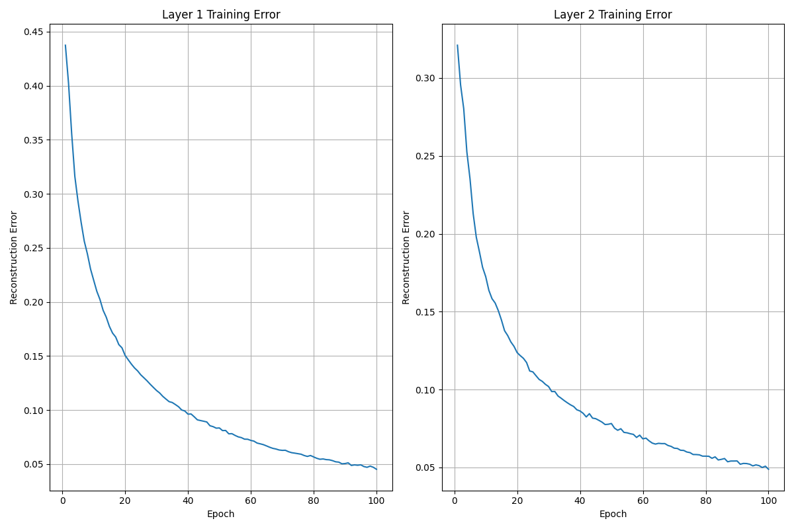
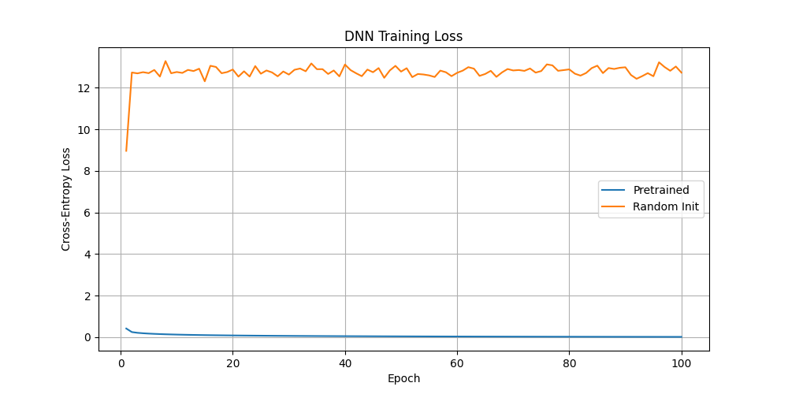
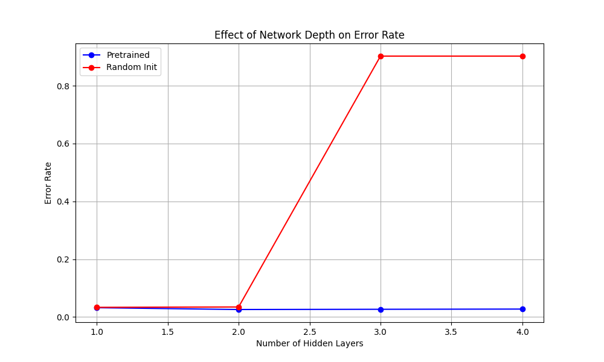
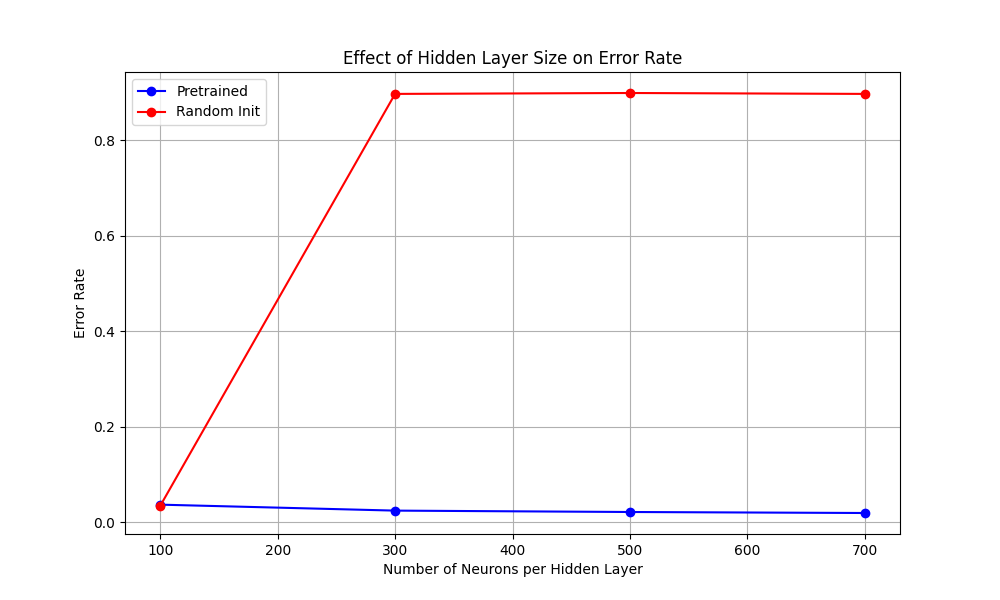
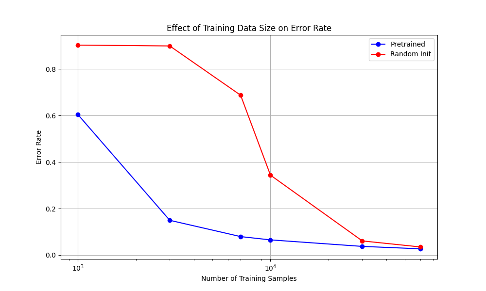

# Réseau de Neurones Profond pour la Classification de Chiffres Manuscrits  
**Auteur : CHAHBOUN El Houssaine**  

## Introduction  

Ce projet implémente des réseaux de neurones profonds (DNN) pour la classification de chiffres manuscrits, en comparant les performances des réseaux pré-entraînés à celles des réseaux initialisés aléatoirement. des Machines de Boltzmann Restreintes (RBM) sont utilisées pour un pré-entraînement non supervisé et implémentons une architecture complète de Réseau de Croyance Profond (DBN).  

Le projet est composé des éléments suivants :  
1. Implémentation des RBM pour l'apprentissage non supervisé  
2. Implémentation d'un DBN pour le pré-entraînement couche par couche  
3. Implémentation d'un DNN avec un affinage supervisé  
4. Expériences comparant les réseaux pré-entraînés et les réseaux initialisés aléatoirement  

## Prérequis  

- Python 3.x  
- NumPy  
- Matplotlib  
- SciPy 
- Sklearn 

## Jeux de données  

Le projet utilise deux jeux de données :  
1. **Binary Alpha Digits** : Un jeu de données simple pour tester les implémentations des RBM et DBN  
2. **MNIST** : Le jeu de données principal pour les expériences d’évaluation  

## Structure du Code  

L'implémentation est organisée en plusieurs fichiers :  

- `rbm_implementation.py` : Classe RBM et fonctions utilitaires associées  
- `dbn_implementation.py` : Classe DBN pour le pré-entraînement  
- `dnn_implementation.py` : Classe DNN avec entraînement par rétropropagation  
- `mnist_loader.py` : Fonctions pour charger et prétraiter les données MNIST  
- `experiment_scripts.py` : Scripts principaux pour exécuter les expériences  

## Comment Exécuter  

1. Téléchargez les jeux de données :  
   - **Binary Alpha Digits** : `binaryalphadigs.mat` depuis [Kaggle](https://www.kaggle.com/datasets/angevalli/binary-alpha-digits)  
   - **MNIST** : Télécharger depuis [le site de Yann LeCun](http://yann.lecun.com/exdb/mnist/)  

      - In the making of this code the MNIST dataset was no longer available in the provided link. I have used sKLEARN'S OpenML to get a version of MNIST(il n'est pas nécessaire de télécharger MNIST manuellement).  

2. Placez les fichiers du jeu de données dans le répertoire  du projet.  

3. Exécutez les expériences :  
   ```python
   python experiment_scripts.py
   ```  

4. Pour exécuter des expériences spécifiques, décommentez la fonction correspondante dans la section `__main__` de `experiment_scripts.py`.  

## Détails de l'Implémentation  

### Implémentation des RBM  

L'implémentation des RBM comprend :  
- Initialisation avec des poids aléatoires et des biais nuls  
- Algorithme d'apprentissage par Divergence Contrastive  
- Fonctions pour l'échantillonnage et la génération d'images  

### Implémentation des DBN  

Le DBN est constitué de RBM empilées et inclut :  
- Pré-entraînement couche par couche  
- Propagation avant  
- Fonctions de modèle génératif  

  
*Figure 1 : Erreurs d'entraînement lors du pré-entraînement du DBN, montrant la diminution de l'erreur de reconstruction au fil des époques.*  

### Implémentation des DNN  

Le DNN repose sur l’architecture du DBN avec :  
- Une couche de sortie softmax pour la classification  
- Rétropropagation pour l'affinage supervisé  
- Fonctions de mesure des erreurs  

  
*Figure 2 : Comparaison des pertes d'entraînement entre DNN pré-entraînés et initialisés aléatoirement, montrant une convergence plus rapide et une perte finale plus faible avec le pré-entraînement.*  

## Résultats Expérimentaux  

on mene 3 experiences, comme indiqué dans la consigne, pour évaluer l'impact du pré-entraînement sur la performance des réseaux neuronaux :  

### 1. Effet de la Profondeur du Réseau  

on compare des réseaux avec un nombre variable de couches cachées (de 1 à 4), en maintenant un nombre constant de 200 neurones par couche. Les résultats montrent que :  

- Les réseaux pré-entraînés surpassent systématiquement les réseaux initialisés aléatoirement  
- L’avantage du pré-entraînement est plus marqué avec l'augmentation de la profondeur  
- Au-delà de 3 couches, la performance se dégrade en raison du problème du gradient évanescent  

  
*Figure 3 : Précision en fonction de la profondeur du réseau. L’écart de performance augmente avec la profondeur.*  

### 2. Effet de la Taille des Couches Cachées  

on teste différentes tailles de couches cachées (100, 300, 500, 700 neurones) en conservant une architecture à 2 couches cachées. Les résultats montrent que :  

- Le pré-entraînement procure un avantage constant, quel que soit la taille de la couche  
- La performance s’améliore jusqu’à environ 500 neurones, puis se stabilise  
- Les réseaux initialisés aléatoirement bénéficient davantage d’une augmentation de la taille des couches que les réseaux pré-entraînés  

  
*Figure 4 : Précision en fonction de la taille des couches cachées.*  

### 3. Effet de la Taille du Jeu de Données  

Nous avons varié le nombre d'exemples d'entraînement (1000, 3000, 7000, 10000, 30000, 60000) et comparé les performances. Les résultats indiquent que :  

- Le pré-entraînement est particulièrement bénéfique lorsque les données sont limitées  
- L'écart entre les réseaux pré-entraînés et aléatoires diminue avec l'augmentation des données  
- Avec l’ensemble complet, le pré-entraînement offre toujours un léger avantage  

  
*Figure 5 : Précision en fonction de la taille du jeu de données.*  

## Analyse des Résultats  

### Efficacité du Pré-entraînement  

Les résultats montrent clairement que le pré-entraînement non supervisé via RBM améliore la performance globale du réseau. Points clés :  

1. **Utilité avec Peu de Données** : Le pré-entraînement est particulièrement avantageux lorsque les données d'entraînement sont limitées.  
2. **Avantage pour les Réseaux Profonds** : Plus le réseau est profond, plus l'initialisation offerte par le pré-entraînement est cruciale.  
3. **Meilleure Généralisation** : Les réseaux pré-entraînés se généralisent mieux aux données de test.  

### Performance Générative  

1. **RBM Unique** : Captent bien la structure des chiffres, mais sont limités sur des ensembles plus complexes.  
2. **DBN** : Produit des échantillons plus réalistes, grâce à l'apprentissage hiérarchique.  

## Limitations 

1. **Sensibilité aux Hyperparamètres** : Une recherche plus approfondie des hyperparamètres pourrait améliorer les résultats.  
2. **Efficacité Computationnelle** : Le pré-entraînement est coûteux en calcul.  
3. **Comparaison avec des Architectures Modernes** : Étudier les techniques comme la normalisation par lots ou les connexions résiduelles.  

## Conclusion  

Les expériences confirment que le pré-entraînement non supervisé avec des RBM améliore significativement la classification des chiffres manuscrits. L'avantage est le plus prononcé lorsque les données d'entraînement sont limitées ou lorsque les réseaux sont profonds.  

